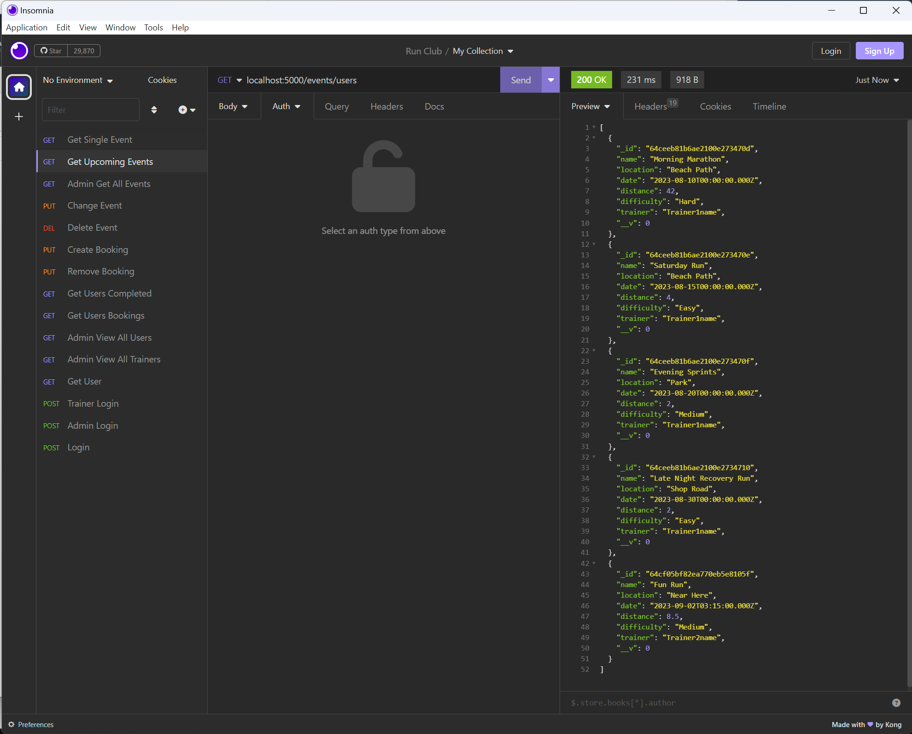
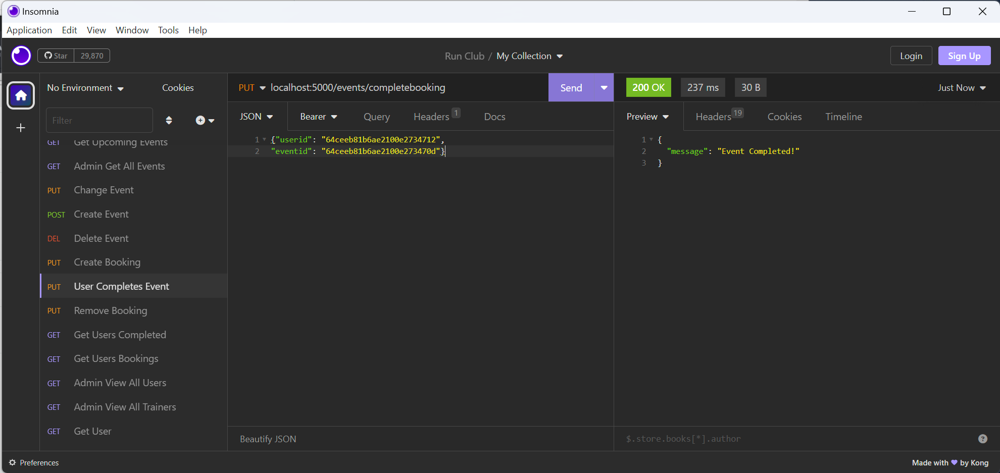
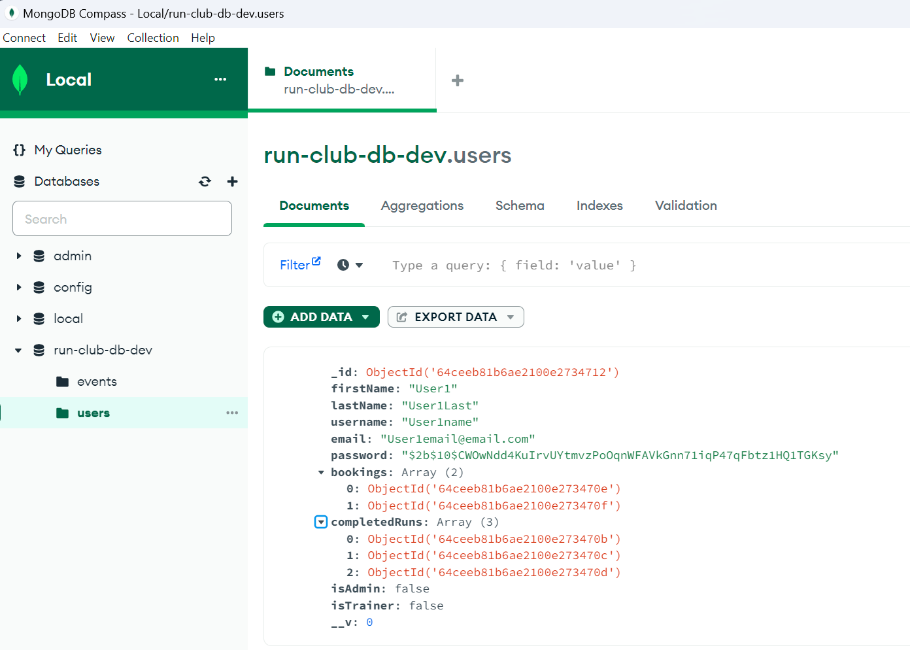
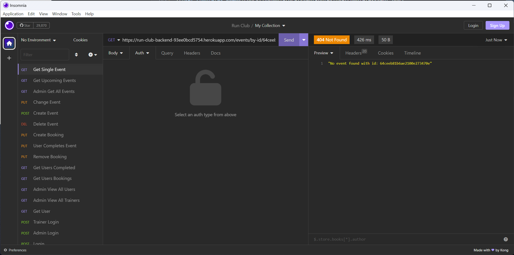
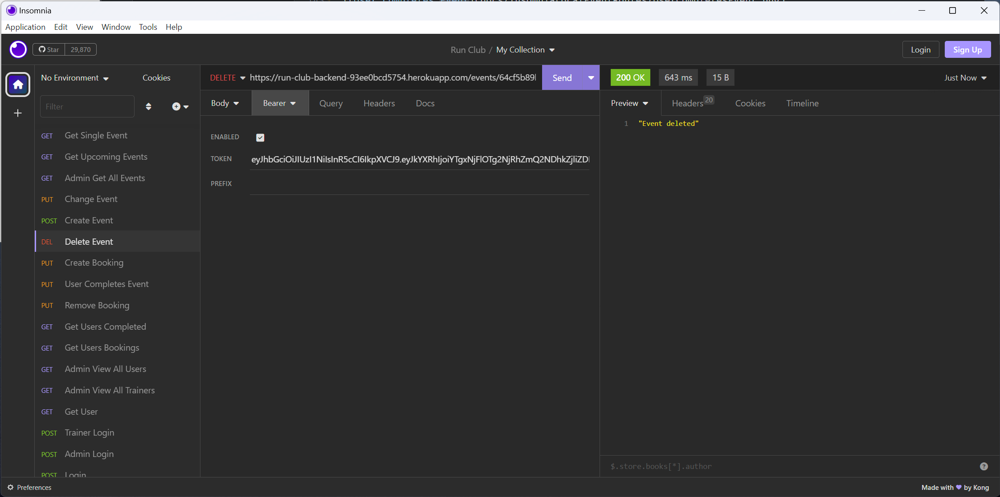
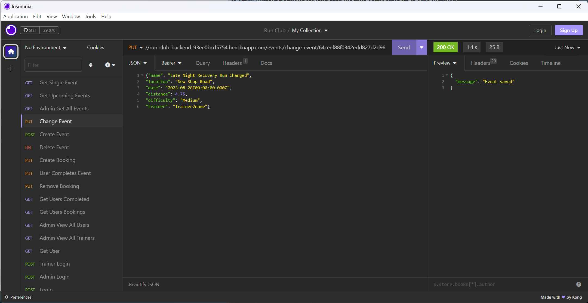

# T3A2 - Part B

## Run Club MERN full stack application

### Authors: Laurence Walton and Liam Massey

#### Presentation part B - [Laurence Part]() [Liam Part]()

#### [Repo for documentation](https://github.com/Run-Club-CA/run-club-doc) 

---

### Table of Contents

- [Purpose](https://github.com/Run-Club-CA/run-club-doc#purpose)
- [Functionality/Features](https://github.com/Run-Club-CA/run-club-doc#functionalityfeatures)
- [Target Audience](https://github.com/Run-Club-CA/run-club-doc#target-audience)
- [Tech Stack](https://github.com/Run-Club-CA/run-club-doc#tech-stack)
- [User Stories](https://github.com/Run-Club-CA/run-club-doc#user-persona-runner)
- [Application Architecture Diagram](https://github.com/Run-Club-CA/run-club-doc#application-architecture)
- [Dataflow Diagrams](https://github.com/Run-Club-CA/run-club-doc#dataflow-diagrams)
- [Project methodology + management screenshots](https://github.com/Run-Club-CA/run-club-doc#project-methodology-and-management-screenshots)
- [Wireframes](https://github.com/Run-Club-CA/run-club-doc#wireframes)

---

### Purpose

A New South Wales running and sports shoe store has a local running club located in Waverley, that has for the most part been organized by using facebook.  
The owners of the store feel that although their group on facebook has been useful, its also created some challenges such as updating and cancelling events due to unforeseen circumstances, having a more easier to understand calender, and not being as user friendly as they would like.

The purpose of the Run club application is to address these issues and create a user friendly, community driven and welcoming place. The application will allow regular users to view upcoming events, keep track of any changes to events and track their own progress with how many kms have been run from completed events. Where the app will also benefit the trainers by giving them better autonomy with scheduling their events, as well as being able to update or cancel events with ease and check off completed runs for attendees.

The running club is looking to create an app that promotes a healthier lifestyle, is community focused and inclusive.

---

- Deployed App: https://therunclub.netlify.app/

- Front-end Repo: https://github.com/Run-Club-CA/front-end-repo

- Back-end Repo: https://github.com/Run-Club-CA/back-end-repo

📖 Part A Documentation Repo: 

## Installation and Usage Instructions

To use the deployed production app enter https://therunclub.netlify.app/ into your browser.

To use the app locally, please follow the below instructions.

Requirements:

Back-end:

Front-end:

To view as admin:

- Use the admin account below:
  email: Admin1email@email.com
  password: UAdmin1Pass

To view as a trainer:

- Use the trainer account below:
  email: Trainer1email@email.com
  password: Trainer1Pass

To view as a user:

- Use the account below or sign up as a new user.
  email: User1email@email.com
  password: User1Pass

---

### Libraries Used

- **bcrypt**: The bcrypt library is a tool for enhancing the security of web applications, particularly within the MERN (MongoDB, Express.js, React, Node.js) stack. It is mostly used for hashing and salting user passwords, ensuring that passwords are not stored in plaintext and are resistant to brute-force attacks. We have used bcrypt alongside Express.js middleware to hash passwords before they are stored in a MongoDB database and to verify passwords during user login.

- **cors**: The CORS (Cross-Origin Resource Sharing) library is used to provide a middleware that can enable cross-origin requests, allowing the frontend and backend parts of an application to communicate, even if they are hosted on different domains. In our MERN app the React frontend makes requests to the Express backend API, potentially triggering cross-origin restrictions imposed by web browsers for security. By integrating the CORS library into the Express.js layer , we define which origins are permitted to access resources, ensuring functionality and security of our app.

- **dotenv**: The dotenv library enables developers to separate confidential and environment-specific configurations from their codebase by loading them from an .env file. Sensitive information like API keys or database credentials are not hard-coded into the application and can be changed depending on the environment. In our app, dotenv is used within the Node.js and Express.js backend to securely manage connection strings to the MongoDB database and hides secret keys used in encryption and for the jwt.

- **Express.js**: A minimal and flexible Node.js web application framework that provides a features for web and mobile applications. In the MERN stack, it serves as the backend server framework and handles HTTP requests, application routing, and MongoDB database interactions, enabling CRUD operations and data persistence. The middleware architecture it provides simplifies tasks like authentication and error-handling, streamlining the development process in MERN applications.

- **helmet**: Helmet middleware for Express.js applications, helps with securing HTTP headers sent between server and client. Certain headers can expose sensitive information about your application, making it susceptible to attack. With Helmet, developers can easily set secure headers, protecting the application from vulnerabilities like Cross-site Scripting and Clickjacking.

- **jsonwebtoken**: The jsonwebtoken library facilitates the creation and verification of JSON Web Tokens (JWTs). JWTs serve as compact, URL-safe means of representing claims to be transferred between two parties, and is used for authentication and information exchange in our app. Upon successful user authentication using Express and MongoDB on the server side, a JWT is generated and sent back to the client. The client, our React application frontend, then stores this token and passes it back in the headers of subsequent requests to access protected resources.

- **mongoose**: Mongoose is an Object Data Modeling (ODM) library for MongoDB and Node.js. It provides a schema solution to model application data, allowing us to define types and validators for all of the app's data items. It offers built-in type casting, query building, and business logic hooks, which we have used for data integrity and consistency. Within our MERN app Mongoose serves as the primary bridge between Express.js (backend framework) and MongoDB (database), allowing for fetching, storing, and manipulating data.

- **jest**: Jest is a testing framework developed by Facebook for JavaScript codebases. Jest creates unit and integration tests for the React frontend and Node.js backend. We use Jest to simulate user behavior, verify the correct rendering of React components, and ensure that the integrated parts of the application function as expected. By testing with Jest we are able to expect a more resilient and maintainable applications.

- **nodemon**: Nodemon is a utility that monitors for any changes in our Node.js application and automatically restarts the server, making the development process smoother. By observing the modifications made in the server-side codebase, we were able to bypass the recurring task of manually stopping and starting the server after each change.

- **supertest**: The supertest library is a prominent testing tool designed specifically for HTTP assertions. We have used it to test Express routes and endpoints, ensuring that the backend API behaves as expected. We have made HTTP requests to the Express server and received assertions about the resulting response, such as status codes, headers, and response body. 

- **axios**: We have used the Axios library to make HTTP requests from React frontend to fetch data from or send data to the Express.js backend server. Axios provides a way to create an instance with default settings, making it easy to set up base URLs, headers, and other request configurations.

- **react**: The React library is a JavaScript framework that we used to create interactive and reusable user interface components for our web app. React stands out due to its virtual DOM mechanism, which optimizes rendering and ensures efficient updates by only altering elements that have changed, and managing the user interface.

- **react-datepicker**: React-datepicker library was used to create a user-friendly date picker component for our running events. Integrating react-datepicker allows for efficient date selection and manipulation, helping apps deal with scheduling, event management, or any functionality that requires date input. The date picker aligns with both the design and functional requirements we had for the app. It also works with React's state management and form handling mechanisms to create and hold date information in our MERN app.

- **react-dom**: The react-dom library is facilitates the rendering of React components to the Document Object Model (DOM), which represents the structure of an HTML document. In our app, react-dom acts bridges React's virtual DOM and the actual browser DOM, ensuring efficient and optimized updates to the webpage. When changes occur in the React components, react-dom updates only the affected parts of the real DOM, rather than re-rendering the entire page and improves performance.

- **react-router-dom**: React-router-dom library provides a collection of navigational components that enable developers to define multiple routes and render different user interfaces depending on the current URL path. Integrating react-router-dom within our MERN app allows us to establish dynamic client-side routing for the React part of the MERN stack for easy transitions between different views or components without the need for a full page reload. This offers users a responsive and reactive web experience, like navigating through multiple pages, but with the speed and efficiency of a single-page application.

- **react-scripts**: A set of scripts and configurations bundled together by the Create React App team to facilitate the easy creation and management of React applications. It abstracts away Webpack, Babel, ESLint, and other tools, so we as develors can focus on development without the need for manual setup. React-scripts primarily manages the React front-end development process.

- **react-toastify**: The react-toastify library provides a customizable notification system for React applications, enabling us to display toast notifications to users within our app. In this way we can give feedback to users, such as success messages, warnings, or errors, conveying the results of database operations or API calls, and ensuring that the end-users are always informed about the app's processes and responses. We believe this greatly enhances the user experience.

- **react-use**: The react-use library offers a collection of useful React hooks that for applications functionaly without needing to create custom hooks from scratch. These hooks can streamline the development process, especially when managing side effects, handling complex states, or integrating with other system components. For instance, we can use hooks like useFetch to fetch user data from an Express.js backend or use useLocalStorage to cache data in the browser for better performance. This helps us to maintain clean and readable code in our app.

- **web-vitals**: A toolset provided by Google to measure and optimize the performance of web applications with a focus on user experience. It gauges metrics such as Largest Contentful Paint (LCP), First Input Delay (FID), and Cumulative Layout Shift (CLS) that are factors in a web app's speed and responsiveness. We are able to evaluate the front-end React components' performance and their impact on the end user's experience and make the server-side and client-side operations streamlined and optimized for the best possible user interaction. This helps in achieving higher user satisfaction, better engagement rates, and improved overall application performance.

- **tailwindcss**: The highly customizable, low-level CSS framework that allows for the rapid construction of custom user interfaces with a set of utility classes. We used TailwindCSS to hasten the styling process for React components, quickly producing responsive and maintainable UIs. This acheives both efficient and consistent designs across the application.

---

### Testing

For our app we have used manual testing on local and production versions of the app, testing our local and deployed backend routes with insomnia, and written automated tests for the front and back end.

- **Local**: 

#### Event Routes

- Trainer creates an event

- User gets upcoming events only

- User completes Event

Note that the events ID is moved from user bookings to user's completed in database.

See [Docs](docs/InsomniaLocalEventRoutes) for all screenshots of all local event routes.

- **Production**: 

#### Event Routes

- Get Event, Wrong ID

- Trainer Deletes Event

- Trainer Edits Event

See [Docs](docs/InsomniaProductionEventRoutes) for all screenshots of all Production event routes.

- **User Stories**: 

