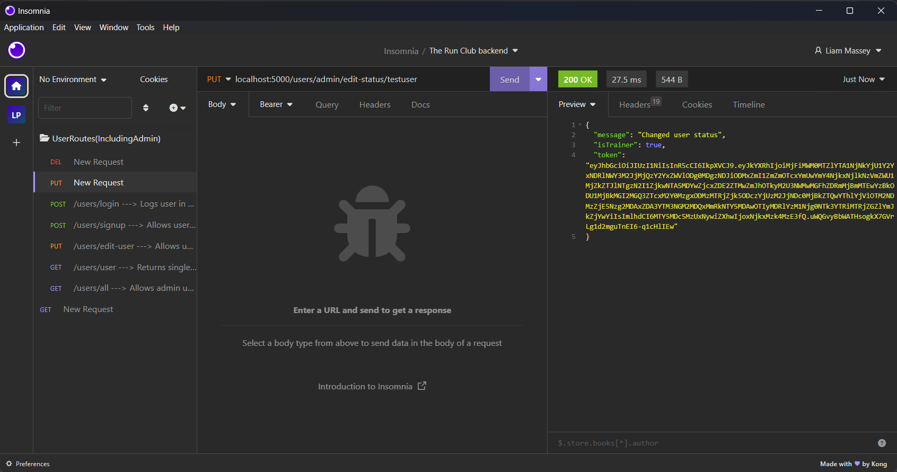
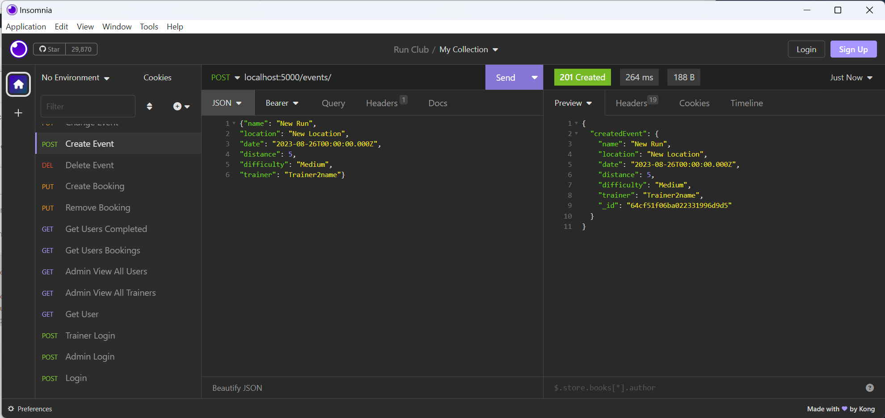

# T3A2 - Part B

## Run Club MERN full stack application

### Authors: Laurence Walton and Liam Massey

#### Presentation part A - [Laurence Part]() [Liam Part]()

#### [Deployed App](https://therunclub.netlify.app/)

#### [Front-end Repo](https://github.com/Run-Club-CA/front-end-repo)

#### [Back-end Repo](https://github.com/Run-Club-CA/back-end-repo)

#### [Repo for documentation](https://github.com/Run-Club-CA/run-club-doc)

---

### Table of Contents

- Purpose
- Installation and usage
- Libraries Used
- Testing
- Project methodology
- task delegation
- feature and design changes
- Website screenshots
- Trello screenshots
- Part A documentation

Not all part A documentation is included, some wireframes are left in the previous file due to readability can be accessed here [wireframes](PartA/docs/wireframes)

---

### Purpose

A New South Wales running and sports shoe store has a local running club located in Waverley, that has for the most part been organized by using facebook.  
The owners of the store feel that although their group on facebook has been useful, its also created some challenges such as updating and cancelling events due to unforeseen circumstances, having a more easier to understand calender, and not being as user friendly as they would like.

The purpose of the Run club application is to address these issues and create a user friendly, community driven and welcoming place. The application will allow regular users to view upcoming events, keep track of any changes to events and track their own progress with how many kms have been run from completed events. Where the app will also benefit the trainers by giving them better autonomy with scheduling their events, as well as being able to update or cancel events with ease and check off completed runs for attendees.

The running club is looking to create an app that promotes a healthier lifestyle, is community focused and inclusive.

---

## Installation and Usage Instructions

To use the deployed production app enter https://therunclub.netlify.app/ into your browser.

To use the app locally, please follow the below instructions:

Install Node.js and MongoDB

Clone the [Front-end](https://github.com/Run-Club-CA/front-end-repo) and [Back-end](https://github.com/Run-Club-CA/back-end-repo) into separate folders.

Back-end:
Move to back-end-repo ($ cd back-end-repo)
Install required packages ($ npm install).
Start the mongoDB process. [See here for information](https://www.mongodb.com/docs/manual/installation/) 
Seed the database $ NODE_ENV=development node src/seeds.js
Start the local express server $ npm run start-dev.
The server will run on local host port 5000.

Front-end:

Move to front-end-repo ($ cd front-end-repo)
Install required packages ($ npm install).
Start the local front-end server ($ npm start)
The server will run on local host port 3000 and should open the site in your browser.

To view as admin:

- Use the admin account below:
  email: Admin1email@email.com
  password: UAdmin1Pass

To view as a trainer:

- Use the trainer account below:
  email: Trainer1email@email.com
  password: Trainer1Pass

To view as a user:

- Use the account below or sign up as a new user.
  email: User1email@email.com
  password: User1Pass

---

### Libraries Used

- **bcrypt**: The bcrypt library is a tool for enhancing the security of web applications, particularly within the MERN (MongoDB, Express.js, React, Node.js) stack. It is mostly used for hashing and salting user passwords, ensuring that passwords are not stored in plaintext and are resistant to brute-force attacks. We have used bcrypt alongside Express.js middleware to hash passwords before they are stored in a MongoDB database and to verify passwords during user login.

- **cors**: The CORS (Cross-Origin Resource Sharing) library is used to provide a middleware that can enable cross-origin requests, allowing the frontend and backend parts of an application to communicate, even if they are hosted on different domains. In our MERN app the React frontend makes requests to the Express backend API, potentially triggering cross-origin restrictions imposed by web browsers for security. By integrating the CORS library into the Express.js layer , we define which origins are permitted to access resources, ensuring functionality and security of our app.

- **dotenv**: The dotenv library enables developers to separate confidential and environment-specific configurations from their codebase by loading them from an .env file. Sensitive information like API keys or database credentials are not hard-coded into the application and can be changed depending on the environment. In our app, dotenv is used within the Node.js and Express.js backend to securely manage connection strings to the MongoDB database and hides secret keys used in encryption and for the jwt.

- **Express.js**: A minimal and flexible Node.js web application framework that provides a features for web and mobile applications. In the MERN stack, it serves as the backend server framework and handles HTTP requests, application routing, and MongoDB database interactions, enabling CRUD operations and data persistence. The middleware architecture it provides simplifies tasks like authentication and error-handling, streamlining the development process in MERN applications.

- **helmet**: Helmet middleware for Express.js applications, helps with securing HTTP headers sent between server and client. Certain headers can expose sensitive information about your application, making it susceptible to attack. With Helmet, developers can easily set secure headers, protecting the application from vulnerabilities like Cross-site Scripting and Clickjacking.

- **jsonwebtoken**: The jsonwebtoken library facilitates the creation and verification of JSON Web Tokens (JWTs). JWTs serve as compact, URL-safe means of representing claims to be transferred between two parties, and is used for authentication and information exchange in our app. Upon successful user authentication using Express and MongoDB on the server side, a JWT is generated and sent back to the client. The client, our React application frontend, then stores this token and passes it back in the headers of subsequent requests to access protected resources.

- **mongoose**: Mongoose is an Object Data Modeling (ODM) library for MongoDB and Node.js. It provides a schema solution to model application data, allowing us to define types and validators for all of the app's data items. It offers built-in type casting, query building, and business logic hooks, which we have used for data integrity and consistency. Within our MERN app Mongoose serves as the primary bridge between Express.js (backend framework) and MongoDB (database), allowing for fetching, storing, and manipulating data.

- **jest**: Jest is a testing framework developed by Facebook for JavaScript codebases. Jest creates unit and integration tests for the React frontend and Node.js backend. We use Jest to simulate user behavior, verify the correct rendering of React components, and ensure that the integrated parts of the application function as expected. By testing with Jest we are able to expect a more resilient and maintainable applications.

- **nodemon**: Nodemon is a utility that monitors for any changes in our Node.js application and automatically restarts the server, making the development process smoother. By observing the modifications made in the server-side codebase, we were able to bypass the recurring task of manually stopping and starting the server after each change.

- **supertest**: The supertest library is a prominent testing tool designed specifically for HTTP assertions. We have used it to test Express routes and endpoints, ensuring that the backend API behaves as expected. We have made HTTP requests to the Express server and received assertions about the resulting response, such as status codes, headers, and response body. 

- **axios**: We have used the Axios library to make HTTP requests from React frontend to fetch data from or send data to the Express.js backend server. Axios provides a way to create an instance with default settings, making it easy to set up base URLs, headers, and other request configurations.

- **react**: The React library is a JavaScript framework that we used to create interactive and reusable user interface components for our web app. React stands out due to its virtual DOM mechanism, which optimizes rendering and ensures efficient updates by only altering elements that have changed, and managing the user interface.

- **react-datepicker**: React-datepicker library was used to create a user-friendly date picker component for our running events. Integrating react-datepicker allows for efficient date selection and manipulation, helping apps deal with scheduling, event management, or any functionality that requires date input. The date picker aligns with both the design and functional requirements we had for the app. It also works with React's state management and form handling mechanisms to create and hold date information in our MERN app.

- **react-dom**: The react-dom library is facilitates the rendering of React components to the Document Object Model (DOM), which represents the structure of an HTML document. In our app, react-dom acts bridges React's virtual DOM and the actual browser DOM, ensuring efficient and optimized updates to the webpage. When changes occur in the React components, react-dom updates only the affected parts of the real DOM, rather than re-rendering the entire page and improves performance.

- **react-router-dom**: React-router-dom library provides a collection of navigational components that enable developers to define multiple routes and render different user interfaces depending on the current URL path. Integrating react-router-dom within our MERN app allows us to establish dynamic client-side routing for the React part of the MERN stack for easy transitions between different views or components without the need for a full page reload. This offers users a responsive and reactive web experience, like navigating through multiple pages, but with the speed and efficiency of a single-page application.

- **react-scripts**: A set of scripts and configurations bundled together by the Create React App team to facilitate the easy creation and management of React applications. It abstracts away Webpack, Babel, ESLint, and other tools, so we as develors can focus on development without the need for manual setup. React-scripts primarily manages the React front-end development process.

- **react-toastify**: The react-toastify library provides a customizable notification system for React applications, enabling us to display toast notifications to users within our app. In this way we can give feedback to users, such as success messages, warnings, or errors, conveying the results of database operations or API calls, and ensuring that the end-users are always informed about the app's processes and responses. We believe this greatly enhances the user experience.

- **react-use**: The react-use library offers a collection of useful React hooks that for applications functionaly without needing to create custom hooks from scratch. These hooks can streamline the development process, especially when managing side effects, handling complex states, or integrating with other system components. For instance, we can use hooks like useFetch to fetch user data from an Express.js backend or use useLocalStorage to cache data in the browser for better performance. This helps us to maintain clean and readable code in our app.

- **web-vitals**: A toolset provided by Google to measure and optimize the performance of web applications with a focus on user experience. It gauges metrics such as Largest Contentful Paint (LCP), First Input Delay (FID), and Cumulative Layout Shift (CLS) that are factors in a web app's speed and responsiveness. We are able to evaluate the front-end React components' performance and their impact on the end user's experience and make the server-side and client-side operations streamlined and optimized for the best possible user interaction. This helps in achieving higher user satisfaction, better engagement rates, and improved overall application performance.

- **tailwindcss**: The highly customizable, low-level CSS framework that allows for the rapid construction of custom user interfaces with a set of utility classes. We used TailwindCSS to hasten the styling process for React components, quickly producing responsive and maintainable UIs. This acheives both efficient and consistent designs across the application.

---

### Testing

For our app we have used manual testing on local and production versions of the app, testing our local and deployed backend routes with insomnia, and written automated tests for the front and back end.

Automated testing is incomplete just due to time constraints but through testing through local routes and front end testing was conducted.

To see our full User testing tracking for Development and Production please visit our [Notion Spreadsheet](https://jazzy-beauty-73b.notion.site/Testing-cda85541080e4c2ca49038cbcd3725d7)

- **Local testing**

#### User Routes

for a full look at user routes access the folder [Docs](docs/InsomniaLocalUserRoutes)

- User Sign up success

- User login success

- User update success

- User delete success

- User get by id

- Admin change user status

- Admin remove user

- Admin get user list

#### Event Routes

- Trainer creates an event

- User gets upcoming events only

- User completes Event

Note that the events ID is moved from user bookings to user's completed in database.

See [Docs](docs/InsomniaLocalEventRoutes) for all screenshots of all local event routes.

- **Production**

#### Event Routes

- Get Event, Wrong ID

- Trainer Deletes Event

- Trainer Edits Event

See [Docs](docs/InsomniaProductionEventRoutes) for all screenshots of all Production event routes.

### Project Methodology and Management Screenshots

For our project we have chosen to do a kanban style project management methodology with the use of trello boards to track our progress. We set up and followed a design board to begin with and have created 2 separate development boards.

Having set up a development/production board that focuses on user stories is to help us tackle the project bit by bit and focus on what is a key feature that is needed for the apps functionality.  
We have set up a development board to track the overall development of the application, which tracks the development and deployment of both front and back ends including the database production server. This board also has testing cards to ensure that we are able to focus on ensuring we have adequate testing for the project.

#### Task delegation

For the task delegation we wanted to get experience on both working front and back end, we set cards from easy to hardest and tackled them with what we felt most comfortable doing. Laurence did all the event routing on the back end whilst Liam worked on the user routing. Liam worked on the front end components of the user features and was able to help out with event features as well to ensure the project was completed. Together we worked in a manner of taking each card one step at a time and focused on making sure the hardest cards were split evenly with our strengths, Laurence was able to tackle and work through the server and database setup including deployment on both heroku and mongodb

### Feature and design changes

On working within this project we had hit a couple periods of hitting various road blocks this caused us to not be able to achieve some of the user stories we were wanting to have marked off.  

The user story relating to wanting notifications was not able to be achieved as we were not too sure on implementation of this feature and started to run out of time constraints, It would be a feature that could be scaled up into quite easily.  

The user story relating to removing events from the application was not able to be achieved at the current time, getting towards the end of the development we had realized there was a small issue relating to how event id's were being stored in user attending runs. The implementation to have some logic in the back end to remove the events efficiently or alternatively setting up another collection to handle attending events could be something implemented in the future without too many issues to the application itself.

There was some small design changes in terms of layout and how the buttons looked and were interacted with, this is purely due to time as we had spent a lot of time learning and working out the best way to develop the front end application. In the end the client was happy with how the end product looked and these style changes could be modified in the future.

### Website screens

more screenshots here [Docs](docs/website-screenshots)

### Trello shots

[Development Board](https://trello.com/b/p9MMTR3I/development)

[User Stories Board](https://trello.com/b/QaIznuzZ/user-stories)

And [docs](docs/Development-trello) for screenshots.

### Part A Documentation

### Functionality/Features

- **User Creation**: Main feature allows users of the application to create their profile. This includes adding their name, username, email, and password to an account. Users can also update their details on the profile and delete their account if required.
  The features of updating and removing an account require the user to be logged in, which will
  have the use of JWT authentication.
- **User Login/Logout**: The user is required to login to the application to view upcoming events/sign up for events etc. Sign up will require the users email and password. Upon authentication the user will be assigned a JSON Web Token that will help reduce the amount of times a user will need to sign in. Users can log out as well when logged in.
- **Admin extras**: As an admin user type, there are permissions that are allowed such as making a regular user a trainer and removing that status.
  Admins can also see a list of all users in the app and search for a user using their name.
- **Homepage/dashboard**: Upon signing up the user will be able to view their profile, along with information of upcoming events they are signed up too. Profile will include amount of KMs ran so far for the user.
- **Event Creation**: Trainers and Admin users are able to create an event and post it up on the calender/event page. This will require information such as the Location, Time, Distance and Difficulty.
- **Event Update/Delete**: Trainers and Admin will be able to remove and update event details of created events. Admin will be able to have access to all events, where trainers only have access to their events for updating and deleting.
- **Event page/calender**: A page will be created that can be navigated too by the user, this event page will have a calender that details what events are coming up and their difficulty. From here Users will be able to sign up to attend.
- **Event Attendance**: Any user is allowed to sign up to attend an event. They are also able to remove themselves from attendance.
- **Completed Run**: Trainers are able to check off the participants of an event after it has happened. This allows the kms to be tracked for users, which adds to the total kms run by that user.

---

### Target Audience

The core users of the app would be individual runners of all fitness levels from fairly new runners to the highly experienced. These users want to be easily connected with like-minded individuals for social engagement, motivation, and to run with trainers to become more skilled about running. The app users would mostly fall between 15-55, cover all genders, income levels, education levels, and marital/parenthood statuses. Geographically, users would live within the Sydney metropolitan area most likely within 20 kilometres of the store location, Waverley. Psychographically, they are likely to be strongly interested in health/fitness, highly social, open to new experiences, and somewhat competitive.

Secondary users would be the run leaders/trainers, who are highly experienced runners who may be volunteers or employees of the running shoe store. They are social, enjoy sharing their passion for running through group runs, and find satisfaction through improving other runners of all levels with their coaching abilities and knowledge of running techniques/gear.

---

### Tech Stack

**Front-end:** HTML5, CSS3, JavaScript, React, TailwindCSS

**Back-end:** Node.js, Express

**Database:** MongoDB

**Testing:** Jest

**Design:** Figma

**Deployment:** Heroku, Netlify

**Project management/Communication:** Trello, Notion

---

### User Persona: Runner

Tom is a 28-year-old male who works on the marketing team of a local brewery. He is a beginner-to-intermediate level runner trying to lead a healthier lifestyle. Joining a local running group was an easy choice for Tom who thought it would help him to stay accountable with his running schedule while meeting friendly locals who shared in his running interest.

Tom has found it to be frustrating to coordinate his schedule with the club's events due to work commitments and the current clubs lack of a proper schedule/calendar. He currently tries to loosely track his kilometres run based on the estimated length of the runs he joins, but would appreciate a more structured run tracker which could also track his progress against other run club users and give him some some extra motivation to show up and push his running further.

#### **User Story: Runner**

- As a runner, Tom would like to signup/login to the app so his experience can be personalised and secure.
- As a runner, Tom would like to find upcoming runs so that he can see which runs fit his schedule.
- As a runner, Tom would like to see the length and difficulty of runs so that he can join runs which match his running abilities.
- As a runner, Tom would like to sign up for runs so as to see the runs he will be attending.
- As a runner, Tom would like to have the runs he completes tracked so that he can track his performance, be rewarded for his consistency, and compete with his friends.
- As a runner, Tom would like to cancel runs he has signed up for but can no longer attend so that they won't show up in his run list and to help the coaches anticipate numbers better.
- As a runner, Tom would like to be notified if a run he has signed up for is being cancelled due to weather etc so that his time isn't wasted traveling to the run and he can schedule other activities at that time.
- As a runner, Tom would like to know how many runs/how many kms he has run in the last week/month so that he can track my metrics for motivation and track his progress towards fitness goals.

### User Persona: Trainer

Alicia is a 32 year old trainer that volunteers for the run club. When she isn't hosting running events she is working as an air traffic controller, or living a busy social life. Alicia is an outgoing person that loves to be challenged and help others achieve and beat their goals.

Alicia finds that the running group she volunteers at is a great way to be engaged within the community, but has found issues with the way its organised. Due to her busy schedule, trying to organise events around other trainers can be difficult without a proper calender. She would love to see the running group be able to have a much more centralized and easy to use app to co-ordinate runs.

#### **User Story: Trainer**

- As Alicia, I want to be able to host running events so that I can help runners achieve their goals and create a sense of community.
- As Alicia, I want to be able to keep track of mine and other trainers upcoming events so that I can keep my schedule organised.
- As Alicia, I want to be able to create my events for the upcoming month before it starts so that I can keep my runners informed.
- As Alicia, I want to keep track of my kms to ensure I am achieving my goals.
- As Alicia, I want to be able to check off the completed runs of my attending runners, so that they can keep track of their KMs.

### User Persona: Admin

Jim Lahey is the owner of the running shoe company that hosts the local running group. Jim is an ambitious, problem solver and community driven. He has been extremely proud of how his run group has grown over the years but is also aware of the issues stemming from the growth.  
Jim is looking to make a more user friendly and inclusive app, that would help bring in more runners and make the organisation of events by his trainers far easier to handle. Jim also believes having a running app will help drive engagement in the sport and ultimately lead to more reoccurring customers.

#### **User Story: Admin**

- As Jim, I want to have a more central location for events being posted so that it is easier for the group to see whats coming up and plan ahead.
- As Jim, I want to give my trainers more autonomy on how they plan, update or cancel their events. So as to give them more freedom to tailor their events to their schedules.
- As Jim, I want to be able to remove members from the group if they are not following our guidelines, so as to ensure we have a safe space for the group.
- As Jim, I want to ensure that the app is user friendly and inclusive to ensure its accommodating for all members of the group.
- As Jim, I want an attractive app that drives up engagement. So that this encourages more customers to come to the store for new equipment.

### Nice To Have Features

After a discussion between the developers and the client regarding time and complexity of some features, it was decided that the below features would be considered "nice to have". These features would be considered desirable if timing and resources permitted, but peripheral to the main functioning of the app.

**Admin**

- As Jim, I want to have a way to track the kilometers ran by members. So that I can celebrate achievements and give prizes to people that hit milestones and can enter the prize draw.

**Trainer**

- As Alicia, I want to be able to see the kms of all runners to be able to give them words of encouragement for making achievements.
- As Alicia, I want to be able to notify runners attending my events of any upcoming changes or cancellations to avoid making any impacts on attendees lives/schedule.

**User**

- As a runner, Tom would like to compare his stats with other runners to gamify his experience, compete with friends, and be rewarded for hitting milestones.
- As a runner, Tom would like to see the forecasted weather on his runs so he can wear appropriate gear.
- As a runner, Tom would like to access a playlist so he can have curated and encouraging music which also results in a shared listening experience with other members.

---

### Application Architecture

---

### Dataflow Diagrams

#### Dataflow User

#### Dataflow Events

---

### WireFrames

#### **For all the wireframes please follow this link** [WireFrames](https://www.figma.com/file/Q99DRegodZIKvAC3OG3anV/WireFrames?type=design&mode=design&t=zR3TrUffzlSp2WPu-1)

Please view [PART A](PartA/README.md) for screen shots of wire frames or alternatively [wireframes folder](PartA/docs/wireframes)

